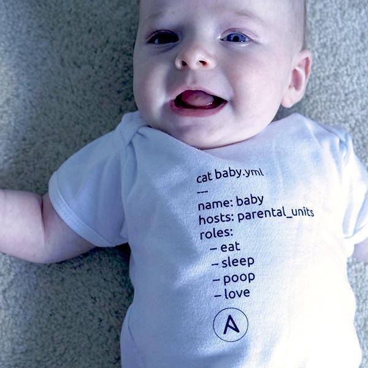

Ansible Playbook Exemplo
===========



Projeto com estrutura de diretórios modularizada para playbook

Requerimentos
------------

É necessário que o ansible esteja instalado no servidor de onde partirá a execução (apt-get/yum install ansible)

Diretórios
------------

* inventory - Destinado à arquivos de inventário a serem utilizados no playbook
* roles - Exemplo de estrutura de roles organizadas por tipos de configurações permitindo maior aproveitamento e modularidade
* keys - Chaves ssh a serem utilizadas no acesso ssh aos servidores que serão configurados
* group_vars - group_vars onde serão configuradas as variáveis de grupo
* host_vars - host_vars onde serão configuradas as variáveis de hosts

Criando a Estrutura
----------------

```shell
mkdir ansible/{inventory,roles,keys,group_vars,host_vars} -p

mkdir ansible/roles/common/{files,templates,tasks,meta,handlers,defaults,vars} -p
```

`tree ansible/`

```shell
ansible/
├── group_vars
├── host_vars
├── inventory
├── keys
├── README.md
└── roles
    └── common
        ├── defaults
        ├── files
        ├── handlers
        ├── meta
        ├── tasks
        ├── templates
        └── vars
```

`tree roles/`

```shell
roles/
└── common
    ├── defaults
    ├── files
    ├── handlers
    ├── meta
    ├── tasks
    ├── templates
    └── vars
```

Exemplo de Execução
----------------

`ansible -i inventory/hosts example -m ping`

`ansible-playbook -i inventory/hosts -vvv example.yml`

Extras
------------
[Docs » User Guide » Working With Playbooks » Advanced Playbooks Features » Tags ](https://docs.ansible.com/ansible/latest/user_guide/playbooks_tags.html)


Ao executar um playbook, você pode filtrar tarefas com base em tags de duas maneiras:

* Na linha de comando, com as opções --tagsou--skip-tags
Nas definições de configuração Ansible, com as opções TAGS_RUN eTAGS_SKIP

* Por exemplo, se você quiser apenas executar as partes "configuration" e "packages" de um playbook muito longo, poderá usar a opção --tags na linha de comando:

`ansible-playbook example.yml --tags "configuration,packages"`

* Por outro lado, se você deseja executar um playbook sem certas tarefas marcadas, pode usar a opção --skip-tags de linha de comando:

`ansible-playbook example.yml --skip-tags "packages"`

* Você pode ver quais tarefas serão executadas usando --tags ou --skip-tags combinadas com --list-tasks:

`ansible-playbook example.yml --tags "configuration,packages" --list-tasks`
